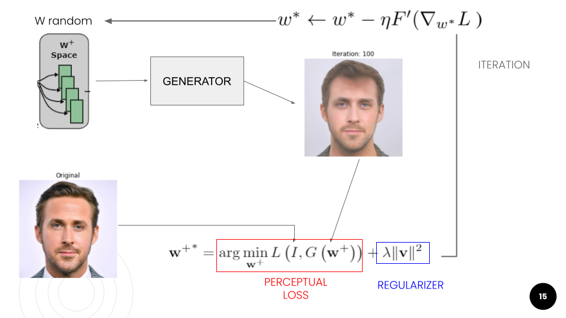

# StyleGAN Embedding Algorithms

This repository aims to reproduce and study some fundamental embedding algorithms, particularly [Image2StyleGAN: How to Embed Images Into the StyleGAN Latent Space?](https://arxiv.org/abs/1904.03189) and [Improved StyleGAN Embedding: Where are the Good Latents?](https://arxiv.org/abs/2012.09036). Also, it is intended to add further experimentations and review some editing operations.

This work was done during my research internship at [King Abdullah University of Science and Technology (KAUST)](https://www.kaust.edu.sa/en), and presented as an article poster for the [Eastern European Machine Learning Summer School - EEML 2021](https://www.eeml.eu/previous-editions/eeml2021).

* [Poster Article at EEML2021](https://www.researchgate.net/publication/356491906_Reproduction_of_Image2StyleGAN_How_to_Embed_Images_Into_the_StyleGAN_Latent_Space)
* [Certificate EEML 2021](https://drive.google.com/file/d/1shWxeAqxcfEUDfkuqxGBx65Q7mpCPLER/view?usp=sharing)
* [Slides](https://docs.google.com/presentation/d/1hScGPQX6iJ2Bxd_dz_Y3_POlgVNREF-NCuFMFyBe9-w/edit?usp=sharing)

## Release

* For learning purposes, you can explore the notebooks at [notebooks/](./notebooks/), where all the programming process was documented. I recommend to explore this first because you can have a better idea about my process step-by-step.
* The [optimzer.py](optimizer.py) script encloses the main optimization algorithm for embeding images into the StyleGAN latent space.
* The scripts [inpainting.py](inpainting.py), [super_resolution.py](super_resolution.py), [colorization.py](colorization.py), [cross_domain.py](cross_domain.py) are scripts based on `optimizer.py`, but with few settings to create different processing images tasks.